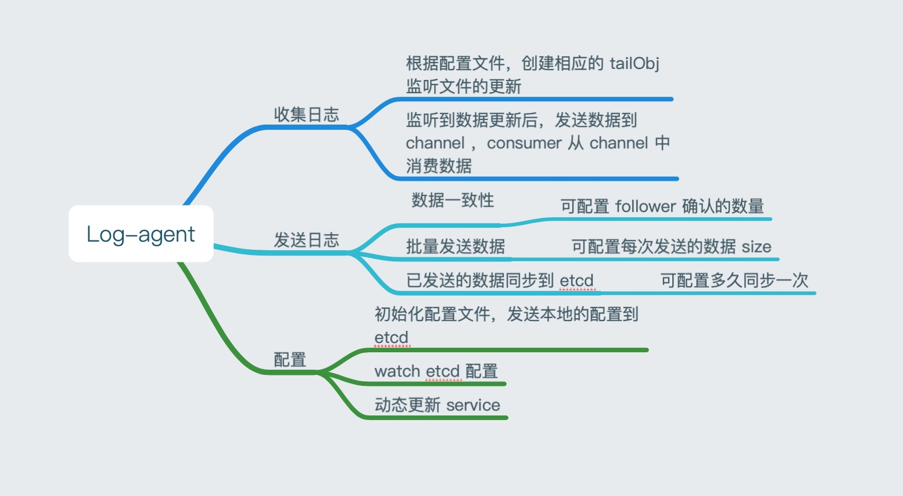

# log-agent-go
日志收集器

- 根据配置收集本地日志，发送到 kafka
- 监听 etcd 的配置，实现服务的动态更新
- 记录已发送的日志 offset 到 etcd ，程序意外退出时保证消息不丢失
- 程序优雅的退出


## 配置详细说明

### kafka

```shell
brokers: 
    - 127.0.0.1:9092
batch_size: 3
required_acks: -1
```
#### brokers
  kafka 连接地址，可配置多个

#### batch_size
  批量发送数据的大小，默认为 100

#### required_acks
  数据发送给 leader 时，需要多少个 follower 的确认，默认为 -1 表示所有的


### etcd

```shell
adderss: 
    - 127.0.0.1:2379
key: panda-server-conf
vals:
    - filepath: /Users/lisen/go/src/log-agent-go/test.log
      topic: log
    - filepath: /Users/lisen/go/src/log-agent-go/go_run.log
      topic: go_run
enable_watch: true
mark_offset_period: 2
```
#### adderss
  etcd 连接地址，可配置多个

#### key
  配置储存在 etcd 的 key

#### vals
  filepath： 文件储存的位置
  topic：发送给 kafka 的 topic

#### enable_watch
  是否开启监听 etcd 配置改动，开启后会把本地的 vals 数据发送到 etcd 并监听这个配置，有改动会动态更新服务

#### mark_offset_period
  发送 offset 到 etcd 的时间间隔，单位为秒
